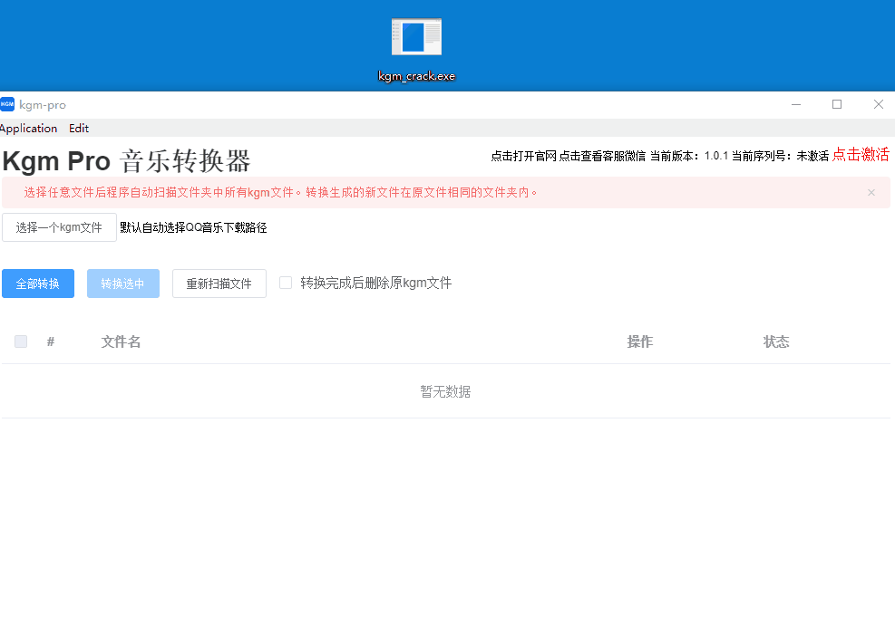

# kgm_cracker
cracker for kgm-pro

[中文文档](README_CN.md)

[KGM-PRO NCM音乐转换器](https://www.yinyuezhushou.com/kgm?from=1)

## DISCLAIMER 

Only for learning related technology, do not use for illegal purposes (this software can download without limits via the proxy)

## Usage



1. Open the cracker
2. Add `127.0.0.1 yinyuezhushou.com` to your hosts file (`C:\\Windows\\System32\\drivers\\etc\\hosts`)
3. Click **点击激活**
4. Random input some numbers
5. Click **激活**

## Compile

```bash
go generate
```